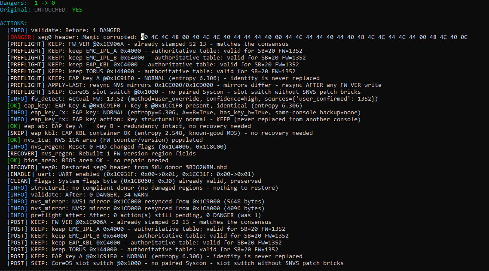

---

## UPDATE - 2026-09-12 (build 0098)

**New in this build:**
- **Y. Regenerate NVS (CID/UNK) - 3 outputs**: donor-based NVS regeneration in 3 variants
  (M1 accurate bytes / M2 blind last-half / M3 both) exactly in the spirit of the
  WeeTools PRO feature, with per-console protections (EAP keys, HDD, FW_VER, core_swch).
  The donor list is shown CLOSEST -> FARTHEST and YOU pick (Enter = closest).
- **Firmware trust rule**: an explicitly present FW_VER that lies inside the
  plausible band of the SouthBridge is TRUSTED (nothing overrides it); blank or
  out-of-band values trigger evidence-based determination + a confirm gate with
  the ranked donor list (option 4).
- **Unified selection** (X / Z / Y / 4): ranked closest-first donor lists based on
  Board ID + FW + SKU evidence - no silent decisions.
- **Licensing**: license.key is now RSA-2048 signed; it verifies on ANY machine
  with no secret present (public key embedded). Keys are HWID-locked.
- **Contact when the trial is exhausted**:
  WhatsApp +201097714567 | Email islamabuaker83@gmail.com | TikTok ps4easytool

## Donors - FULL packages (Google Drive)

All donor packs (NOR raw, nordonors, Syscon, EAP/EMC/Torus blobs) are hosted on
Google Drive:

**https://drive.google.com/drive/folders/1nw79XTzTtsucSJt-p0gZZDlYZowBEdHS?usp=drive_link**

Archive password: **`ISLAMJAMEL`**

Three small convenience packs are attached to this release too
(DONORS-minimal, DONORS-NOR-own-full, DONORS-Syscon-minimal).


# PS4 NOR-SYSCON EASY TOOL - Limited Edition v2.0-beta
**Professional PS4 NOR (sflash) + Syscon repair toolkit**
**أداة احترافية لإصلاح NOR والسيسكون لأجهزة PS4**

Owner / المالك: **ISLAM JA**

> **Trial: 5 REPAIR ATTEMPTS** (not a time limit). Each successful repair consumes one attempt.
> **التجربة: 5 محاولات تصليح** (ليس وقتًا). كل إصلاح ناجح يستهلك محاولة.
> A `license.key` (HWID-locked) removes the limit. / مفتاح `license.key` (مقفل بـ HWID) يزيل الحد.

---

## Main Menu / القائمة الرئيسية
```
Diagnostics (read-only) / التشخيص
  [1] NOR Analyser      / تحليل NOR
  [2] Syscon Analyser   / تحليل Syscon
  [3] UART Log Diagnosis/ تشخيص UART

Repair / التصليح
  [4] Full Auto-Repair (BLOD)
  [D] Downgrade (specialised)      / داونجريد متخصص
  [R] Restore from donor           / استعادة من مانح

Syscon + Donors
  [7] Syscon Matcher + Builder
  [8] Browse Donor Library
  [9] Rebuild Donor Database

Tools / الأدوات
  [10] NOR <-> Syscon Matcher Tool
  [11] Hash Database Manager

EAP Rescue (last resort) / إنقاذ EAP (الملاذ الأخير)
  [X] EAP Rescue All Models (3 outputs)
  [Z] Fat Aeolia EAP Rescue (3 outputs)
  [0] Exit / خروج
```

**Per-option documentation (EN + AR): [OPTIONS_GUIDE.md](OPTIONS_GUIDE.md)**
**شرح كل خيار على حدة: [OPTIONS_GUIDE.md](OPTIONS_GUIDE.md)**

---

## Core guarantee / الضمان الأساسي
**The original dump is NEVER modified.** Every result is a new file in `OUTPUT/`.
**الملف الأصلي لا يُعدّل أبدًا.** كل ناتج ملف جديد داخل `OUTPUT/`.

| EN | AR |
|---|---|
| A donor EAP key can never decrypt your HDD | مفتاح EAP من مانح لا يفك تشفير قرصك |
| CoreOS slot-switch MUST pair with Syscon SNVS patch | تبديل CoreOS يجب أن يُقرن بترقيع SNVS |
| Nothing is written on a guessed firmware | لا يُكتب شيء بناءً على إصدار مُخمَّن |

---

## Screenshots / لقطات من البرنامج




---

## Limited vs Licensed / المحدود مقابل المرخّص

| Limited (GitHub) | Licensed (key) |
|---|---|
| All options above / كل الخيارات | All options / كل الخيارات |
| **5 repair attempts** / **5 محاولات** | Unlimited / غير محدود |
| HWID shown / يظهر HWID | HWID-locked key / مفتاح مقفل |

### License / الترخيص
- Show: `HWID: ... | trial - N repair attempt(s) left`
- After 5: `No repair attempts left - contact ISLAM JA for license.key`
- Place `license.key` in `DONORS/license.key` next to the EXE.
- Format: `v1:HWID:EXP:FEAT:DONOR:SIG` (HMAC-SHA256, HWID-locked).

### Run / التشغيل
```powershell
PS4_NOR_SYSCON_EASY_TOOL_Limited.exe
PS4_NOR_SYSCON_EASY_TOOL_Limited.exe cli
```

---

## Donors / المتبرعون
Minimal NOR donors (~68MB: emc/eap/torus) cover models 10/20/21/22.
حزمة مصغّرة (~68MB) تغطي الطرازات 10/20/21/22.
Reference: https://github.com/andy-man/ps4-ic-fw

## Faults & Repairs / الأعطال والتصليح
See [FAULTS.md](FAULTS.md)

---

## Contact / التواصل
**[CONTACT.md](CONTACT.md)**

- Email / البريد: **islamabuaker83@gmail.com**
- TikTok: https://tiktok.com/@ps4easytool
- GitHub: https://github.com/ISLAMGAZA/PS4-NOR-SYSCON-LIMITED

## Links
- GitHub (Limited repo): https://github.com/ISLAMGAZA/PS4-NOR-SYSCON-LIMITED
- GitHub (owner): https://github.com/ISLAMGAZA
- TikTok: https://tiktok.com/@ps4easytool
- Email: **islamabuaker83@gmail.com**

## Security / الحماية
[SECURITY.md](SECURITY.md)

## License / الترخيص
Proprietary. © ISLAM JA. Redistribution or commercial resale without written permission is prohibited.
ملكية خاصة. © ISLAM JA. يُمنع إعادة التوزيع أو البيع دون إذن كتابي.
