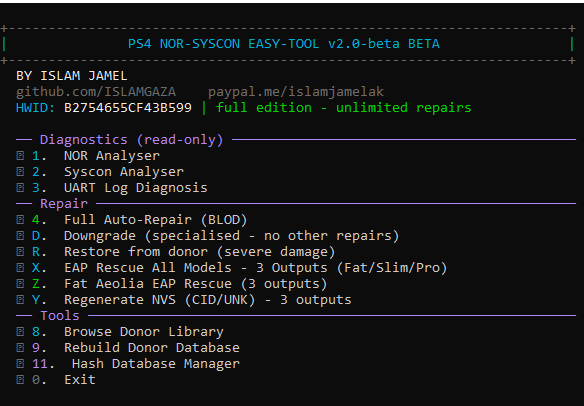

---

## تحديث - 2026-09-12 (البناء 0098)

**الجديد في هذا البناء:**
- **Y. إعادة توليد NVS (CID/UNK) - 3 مخرجات**: ترميم NVS من متبرع بثلاث متغيرات
  (M1 بايتات دقيقة / M2 نسخ أعمى للنصف الأخير / M3 الاثنان) - بروح خاصية WeeTools PRO،
  مع حمايات صارمة (مفاتيح EAP، الهارد، FW_VER، core_swch). قائمة المتبرعين تظهر
  **الأقرب ← الأبعد** وأنت من يختار (Enter = الأقرب).
- **قاعدة الثقة بالفيرموير**: FW_VER موجود صراحةً وداخل الحيّز المعقول للشريحة يُعتمد
  فوراً (لا شيء يتجاوزه)؛ الفارغ/خارج الحيّز يمر عبر الإجماع وبوابة تأكيد بقائمة
  مرتبة (الخيار 4).
- **انتقاء موحّد** (X / Z / Y / 4): قوائم مرتبة الأقرب-أولاً بدليل Board + FW + SKU
  بلا قرارات صامتة.
- **الترخيص**: مفتاح license.key بتوقيع RSA-2048 يتحقق على أي جهاز بلا أسرار
  (المفتاح العام مدمج). المفاتيح مربوطة بالجهاز (HWID).
- **التواصل عند انتهاء المحاولات**:
  واتساب +201097714567 | البريد islamabuaker83@gmail.com | تيك توك ps4easytool

## الدونرز - الباقات الكاملة (جوجل درايف)

جميع باقات الدونرز (رؤوس NOR، nordonors، Syscon، بلوبات EAP/EMC/Torus) على جوجل درايف:

**https://drive.google.com/drive/folders/1nw79XTzTtsucSJt-p0gZZDlYZowBEdHS?usp=drive_link**

باسورد الأرشيف: **`ISLAMJAMEL`**

كما يُرفق مع هذا الإصدار ثلاث باقات مصغّرة مريحة
(DONORS-minimal، DONORS-NOR-own-full، DONORS-Syscon-minimal).


<div dir="rtl">

# PS4 NOR-SYSCON EASY TOOL - النسخة المحدودة (Limited) v2.0-beta

**أداة احترافية لإصلاح NOR (sflash) والسيسكون لأجهزة بلايستيشن 4 - بايثون نقي، بدون مكتبات خارجية**

المالك: **ISLAM JA** - github.com/ISLAMGAZA

> **نموذج التجربة: 5 محاولات تصليح** (ليس وقتًا). كل إصلاح ناجح يستهلك محاولة واحدة.
> مفتاح `license.key` (مقفل بـ HWID) يزيل الحد.

---

## القائمة الرئيسية (كل الخيارات متاحة)

```
التشخيص (قراءة فقط)
  [1] تحليل NOR        - فحص شامل + تقرير + معلومات الجهاز + التكرار + مفتاح EAP
  [2] تحليل Syscon     - البرمجية، الديباج، عارض SNVS/NVS، فحص قابلية الترقيع
  [3] تشخيص UART       - الخطأ -> السبب -> الإجراء المناسب

التصليح
  [4] التصليح التلقائي الكامل (BLOD)
  [D] الداونجريد المتخصص
  [R] الاستعادة من مانح (للدمبات المتضررة بشدة)

Syscon والمتبرعون
  [7] مطابق وباني السيسكون
  [8] تصفح مكتبة المتبرعين
  [9] إعادة بناء قاعدة المتبرعين

الأدوات
  [10] أداة مطابقة NOR <-> Syscon
  [11] إدارة قاعدة الـ Hash

إنقاذ EAP (الملاذ الأخير)
  [X] إنقاذ EAP لكل الطرازات (3 مخرجات)
  [Z] إنقاذ EAP لأجهزة Fat Aeolia (3 مخرجات)
  [0] خروج
```

**شرح تفصيلي لكل خيار (عربي + إنجليزي): [OPTIONS_GUIDE.md](OPTIONS_GUIDE.md)**

---

## الضمان الأساسي (لكل خيار)

**الملف الأصلي لا يُعدّل أبدًا.** كل ناتج يُكتب في ملف جديد داخل مجلد `OUTPUT/`.

قواعد مطلقة إضافية:

| القاعدة |
|---|
| مفتاح EAP من مانح لا يمكنه فك تشفير قرصك أبدًا |
| تبديل خانة CoreOS يجب أن يُقرن بترقيع SNVS للسيسكون |
| لا يُكتب أي شيء بناءً على إصدار مُخمَّن |

---

## المحدود مقابل المرخّص

| المحدود | المرخّص (مفتاح) |
|---|---|
| كل الخيارات أعلاه | نفس الخيارات |
| **5 محاولات تصليح** | محاولات غير محدودة |
| يظهر HWID على الشاشة | مفتاح مقفل بـ HWID |

### الترخيص و HWID
- عند التشغيل: `HWID: ... | trial - N محاولة تصليح متبقية`
- بعد 5 محاولات: `No repair attempts left - contact ISLAM JA for license.key`
- ضع `license.key` في `DONORS/license.key` بجانب البرنامج.
- صيغة المفتاح: `v1:HWID:EXP:FEAT:DONOR:SIG` (توقيع HMAC-SHA256، مقفل بـ HWID).

### التشغيل
```powershell
PS4_NOR_SYSCON_EASY_TOOL_Limited.exe
PS4_NOR_SYSCON_EASY_TOOL_Limited.exe cli
```

---

## المتبرعون (Donors)

- حزمة مصغّرة (~68MB: emc/eap/torus) تغطي كل الطرازات 10/20/21/22 - تكفي لإصلاح النور.
- مرجع خارجي: https://github.com/andy-man/ps4-ic-fw (zecoxao)

---

## الأعطال والتصليح

| الدمب | العطب | التصليح |
|---|---|---|
| 21.BIN | EMC مشبوه | إصلاح الـblobs |
| FAT1XXX | مفتاح EAP ممسوح - بلا Key B | Z (3 مخرجات) |
| MBRERROR | MBR تالف | إصلاح MBR |
| SLIM PR | EMC خاطئ | ترقيع الساوث بريدج |
| W25Q256JV | مفتاح EAP ممسوح | Z |
| nor_dump.bin | SAM_IPL ممسوح | R + التصليح الكامل |

الجدول الكامل: [FAULTS.md](FAULTS.md)

---

## التواصل والدعم والتبرع

[CONTACT.md](CONTACT.md) - الروابط الرسمية وطريقة طلب الدعم.

**البريد الرسمي:** islamabuaker83@gmail.com

**تيكتوك:** https://tiktok.com/@ps4easytool

**جيت هاب:** https://github.com/ISLAMGAZA/PS4-NOR-SYSCON-LIMITED

## الحماية

[SECURITY.md](SECURITY.md) - خطة منع السرقة وحماية المشروع.

## الترخيص

ملكية خاصة. © ISLAM JA. يُمنع إعادة التوزيع أو الاستخدام التجاري دون إذن كتابي.

</div>
